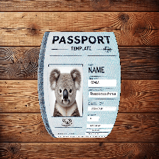

This project is used to augment paper images based on position, curl, and lighting.
```python
import cv2
import imageio
import imageio.v3 as iio
import numpy as np
import math
from mesh_augmentator import MeshModel

output_dim = 224
#prepare data
sample = cv2.imread('sample.jpg')
h, w, dc = sample.shape
k = min(output_dim / h, output_dim / w) * 2.2
sample = cv2.resize(sample, (int(w * k), int(h * k)), interpolation = cv2.INTER_LINEAR)
h, w, dc = sample.shape
background = cv2.imread('wood.jpg')
background = cv2.resize(background, (output_dim, output_dim), interpolation = cv2.INTER_LINEAR)

#render
mesh = MeshModel(100, 100, sample, True, True)
mesh.cylynder_vertical(R = w * 8)
mesh.shift(0, 0, mesh.get_best_object_distance())

mesh.set_output_size(output_dim, output_dim)
output_image = mesh.render(background)
cv2.imwrite("output.jpg", output_image)
```


Depth of field:\


Light position change:\


Light diameter change:\


Shadow:\


Rotate:\


