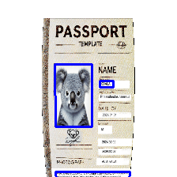

This project is used to augment paper images based on position, curl, and lighting.\

Demo without depth of field\

# Quick start for augment images
Prepare data for augment
```python
import cv2
import numpy as np
from mesh_augmentator import get_random_augment
from os import listdir
from os.path import isfile, join

# get any control points to be set on image
points_src = []
with open("rects.txt") as file:    
    for line in [line.rstrip() for line in file]:
        x, y, w, h = [float(a) for a in line.split(':')[1].split(';')]
        points_src.append((x, y))
```
## In case of many images with background
```python
image = cv2.imread('sample.jpg')
root = 'bgs'
background_fnames = [join(root, f) for f in listdir(root) if isfile(join(root, f))]

# get result image and control points
image, points = get_random_augment(image, 224, 200, points = points_src, backgrounds = None, background_fnames = background_fnames)

# draw control points on result augmented image
for x, y in points:
    cv2.circle(image, (int(x), int(y)), radius=3, color=(0, 0, 255), thickness=-1)
cv2.imwrite('output1.jpg', image)
```

## In case of one or more background images in memory
```python
image = cv2.imread('sample.jpg')
blank_image = np.zeros((224, 200, 3), np.uint8)

# get result image and control points
image, points = get_random_augment(image, 224, 200, points = points_src, backgrounds = [blank_image], background_fnames = None)

# draw control points on result augmented image
for x, y in points:
    cv2.circle(image, (int(x), int(y)), radius=3, color=(0, 0, 255), thickness=-1)
cv2.imwrite('output2.jpg', image)
```

# Information about mesh render

```python
import cv2
from mesh_augmentator import MeshModel

output_dim = 224
#prepare data
sample = cv2.imread('sample.jpg')
h, w, dc = sample.shape
k = min(output_dim / h, output_dim / w) * 2.2
sample = cv2.resize(sample, (int(w * k), int(h * k)), interpolation = cv2.INTER_LINEAR)
h, w, dc = sample.shape
background = cv2.imread('wood.jpg')
background = cv2.resize(background, (output_dim, output_dim), interpolation = cv2.INTER_LINEAR)

#render
mesh = MeshModel(100, 100, sample, True, True)
mesh.cylynder_vertical(R = w * 8)
mesh.shift(0, 0, mesh.get_best_object_distance())

mesh.set_output_size(output_dim, output_dim)
output_image = mesh.render(background)
cv2.imwrite("output.jpg", output_image)
```


Depth of field:\


Light position change:\


Light diameter change:\


Shadow:\


Rotate and curl:\


