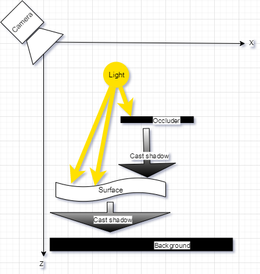

# Mesh Augmentor

Mesh Augmentor is a tiny image-augmentation library that warps images with a 3D-like mesh and can simulate optics and lighting. It’s designed for tasks like “paper bending”, page curling, lens distortion, and realistic shadows—while keeping a simple Python API.


[](https://github.com/pashaalex/mesh_augmentor/releases/latest)


## What it can do

- **Mesh-driven warps** – bend, tilt, or curve a rectangular grid and render the input image on it.
- **Lighting & shadows (optional)** – disk light source, soft shadows (incl. background plane) and a rectangular occluder.
- **Camera & lens** – focal parameters (F/L/R), optional radial distortion (k1), optical center, camera tilt.
- **Multiple outputs**
  - **RGB** – rendered color image
  - **ALPHA** – alpha channel from the renderer
  - **MASK** – validity mask (`uint8`, 0/255)
  - **UV map** – backward sampling map `(H, W, 2)` giving, for each output pixel, the `(x, y)` in the source image to sample
- **Point reprojection** – map source points into output coordinates (useful for keypoints/landmarks).
- **Fast native core** – cross-platform C/C++ library (`.dll/.so/.dylib`) with a thin Python wrapper.

## Schema


## Quickstart

Before using MeshAugmentor, download the latest release package from  
[**Releases**](https://github.com/pashaalex/mesh_augmentor/releases/latest)  
and unpack the ZIP file for your platform (`mesh_render-windows.zip` or `mesh_render-linux.zip`).

After unpacking, you should have the MeshAugmentor.py and cpp folder.
You can now create your own Python scripts **in the same directory**,  
importing `MeshAugmentor` directly without any installation.


```python
import cv2
import math
import numpy as np
from mesh_augmentor import *

def make_grid_image(size=640, step=10, bg_color=(255, 255, 255), line_color=(180, 180, 180)):
    img = np.full((size, size, 3), bg_color, dtype=np.uint8)
    for x in range(0, size, step):
        cv2.line(img, (x, 0), (x, size-1), line_color, thickness=1, lineType=cv2.LINE_AA)
    for y in range(0, size, step):
        cv2.line(img, (0, y), (size-1, y), line_color, thickness=1, lineType=cv2.LINE_AA)
    return img

# 1) Load a source image (BGR, uint8)
src = make_grid_image()

# 2) Create the mesh and set output size
H_out, W_out = 480, 640
grid_w, grid_h = 10, 30  # mesh resolution
ma = MeshAugmentor(input_width=src.shape[1],
                   input_height=src.shape[0],
                   grid_w=grid_w,
                   grid_h=grid_h)

# Optional: configure optics / lighting / distortion (examples)
# ma.set_optics(Optics(F=35.0, L=66.7, R=4.0))
# ma.set_distortion(Distortion(use=True, k1=-0.5, cx=0.0, cy=0.0))
# ma.set_lighting(Lighting(use=True, x=0, y=0, z=10, intensity=0.99, diameter=10, light_mix_koef=0.99))
# ma.set_background_shadow(BackgroundShadow(use=True, bg_z=0.0))

cylynder_horizontal(ma, R = 10000)
# Optional: modify the mesh points directly (paper-like bend)
for index, point in enumerate(ma.points):
    point.x = point.x + 10
    point.y = point.y + 10
    point.z = point.z + 10

ma.shift(10, 10, 10)
ma.rotate_x(math.radians(2))
ma.rotate_z(math.radians(2))
ma.fit_best_geometric(
        W_out=640,
        H_out=480,
        margin = 0.75)
# 3) Render requested outputs
outs = ma.render(input_image=src,
                 out_size=(W_out, H_out),
                 background = np.full((H_out, W_out, 3), (128, 128, 128), dtype=np.uint8),
                 attachments=("rgb", "alpha", "mask", "uv"))

# 4) Use what you need
rgb  = outs.rgb        # (H_out, W_out, 3) uint8
alpha = outs.alpha     # (H_out, W_out)    uint8 or None
mask = outs.mask       # (H_out, W_out)    uint8 or None
uv   = outs.uv         # (H_out, W_out, 2) float32 or None

# 5) Optional: work with keypoints
# keypoints = []
# for x in range(1, src.shape[0], 50):
#     for y in range(1, src.shape[1], 50):
#         keypoints.append((x, y))

# new_keypoints = [ma.reproject_point(x, y, W_out, H_out) for x, y in keypoints]
# for x, y in new_keypoints:
#     cv2.circle(rgb, (int(x), int(y)), radius=2, color=(255,0,0), thickness=-1)

cv2.imwrite("output_rgb.png", rgb)
