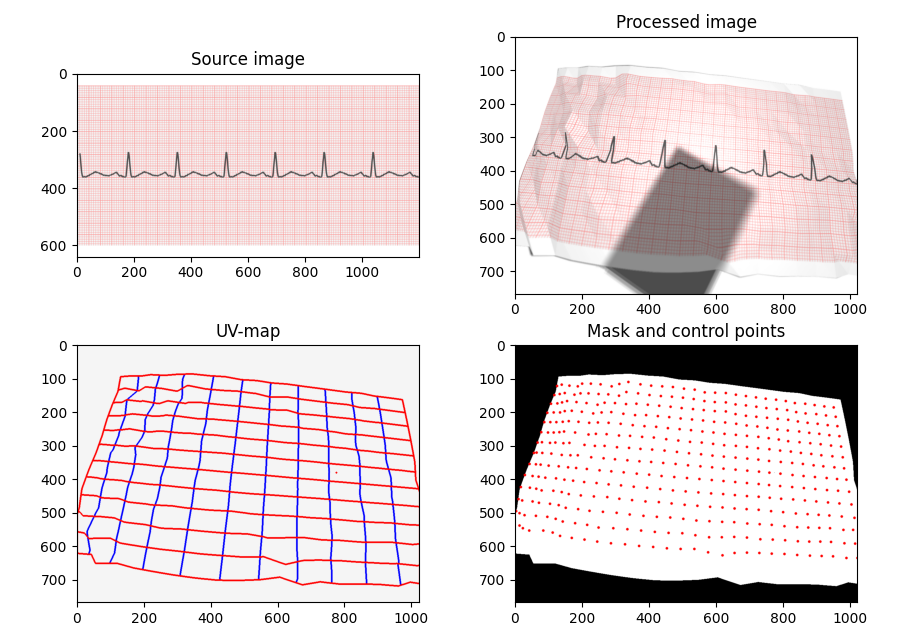

# Mesh Augmentor

Mesh Augmentor is a tiny image-augmentation library that warps images with a 3D-like mesh and can simulate optics and lighting. It’s designed for tasks like “paper bending”, page curling, lens distortion, and realistic shadows—while keeping a simple Python API.



## What it can do

- **Mesh-driven warps** – bend, tilt, or curve a rectangular grid and render the input image on it.
- **Lighting & shadows (optional)** – disk light source, soft shadows (incl. background plane) and a rectangular occluder.
- **Camera & lens** – focal parameters (F/L/R), optional radial distortion (k1), optical center, camera tilt.
- **Multiple outputs**
  - **RGB** – rendered color image
  - **ALPHA** – alpha channel from the renderer
  - **MASK** – validity mask (`uint8`, 0/255)
  - **UV map** – backward sampling map `(H, W, 2)` giving, for each output pixel, the `(x, y)` in the source image to sample
- **Point reprojection** – map source points into output coordinates (useful for keypoints/landmarks).
- **Fast native core** – cross-platform C/C++ library (`.dll/.so/.dylib`) with a thin Python wrapper.

## Quickstart

```python
import cv2
import numpy as np
from mesh_augmentor import MeshAugmentor

# 1) Load a source image (BGR, uint8)
src = cv2.imread("input.png")  # H_src x W_src x 3

# 2) Create the mesh and set output size
H_out, W_out = 480, 640
grid_w, grid_h = 20, 12  # mesh resolution
ma = MeshAugmentor(img_width=src.shape[1], img_height=src.shape[0],
                   grid_w=grid_w, grid_h=grid_h)

# Optional: configure optics / lighting / distortion (examples)
# ma.set_optics(F=35.0, L=66.7, R=14.0)
# ma.set_distortion(use=True, k1=-0.5, dist_norm=66.7, cx=0.0, cy=0.0)
# ma.set_lighting(use=True, x=0, y=0, z=10, intensity=0.6, diameter=170)
# ma.set_background_shadow(use=True, bg_z=0.0)

# Optional: modify the mesh points directly (paper-like bend)
for index, point in enumerate(ma.points):
    point.x = point.x + 10
    point.y = point.y + 10
    point.z = point.z + 10

# 3) Render requested outputs
outs = ma.render(src_bgr=src, out_size=(W_out, H_out),
                 attachments=("rgb", "alpha", "mask", "uv"))

# 4) Use what you need
rgb  = outs.rgb        # (H_out, W_out, 3) uint8
alpha = outs.alpha     # (H_out, W_out)    uint8 or None
mask = outs.mask       # (H_out, W_out)    uint8 or None
uv   = outs.uv         # (H_out, W_out, 2) float32 or None

cv2.imwrite("output_rgb.png", rgb)

